<p align="center">
  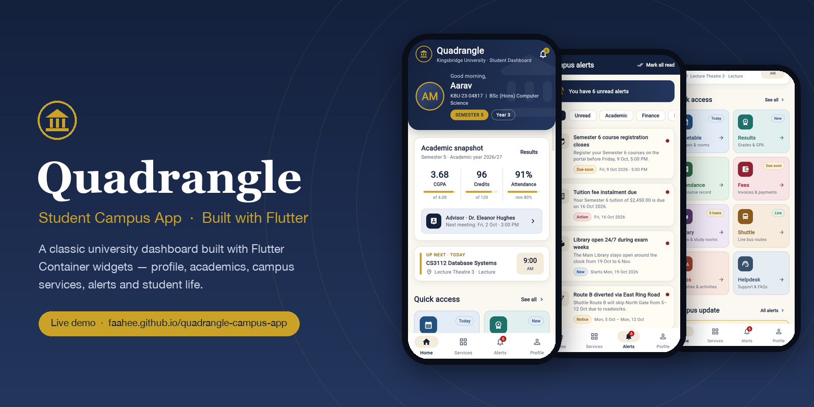
</p>

<h1 align="center">Quadrangle — Student Campus App</h1>

<p align="center">
  A classic, fully interactive university dashboard built with <b>Flutter</b>,<br>
  designed around meaningful use of the <code>Container</code> widget.
</p>

<p align="center">
  <a href="https://faahee.github.io/quadrangle-campus-app/"></a>
</p>

<p align="center">
  <a href="https://github.com/faahee/quadrangle-campus-app/actions/workflows/deploy.yml"></a>
  
  
  
  
  
</p>

---

## Table of contents

- [Overview](#overview)
- [Features](#features)
- [Demo](#demo)
- [Screenshots](#screenshots)
- [How it works](#how-it-works)
- [Architecture](#architecture)
- [Design system](#design-system)
- [Getting started](#getting-started)
- [Deployment](#deployment)
- [Project structure](#project-structure)
- [Assessment checklist](#assessment-checklist)
- [Roadmap](#roadmap)
- [Credits](#credits)

---

## Overview

**Quadrangle** is the home dashboard of a Student Campus App for the fictional
**Kingsbridge University**. It greets the student, summarises their academic
standing, gives one-tap access to eight campus services, and surfaces
time-sensitive announcements and student-life events.

The project was built for the *Flutter Container Widget* assignment, so every
section is composed from purposeful `Container`s — for sizing, spacing,
alignment, constraints, and `BoxDecoration` (colour, border, radius, gradient,
shadow). Beyond the dashboard, **every button works**: services open real pages,
payments update balances, registrations change state, and alerts can be read
and filtered.

> All names, IDs, grades, and dates are fictional sample data. No database,
> login, or network API is required.

## Features

| | Feature | Details |
|---|---|---|
| 🏛️ | **Dashboard** | Greeting that changes with the time of day, student profile, semester badges, notification bell with live unread count |
| 🎓 | **Academic snapshot** | CGPA, credits and attendance with progress bars, plus an advisor appointment strip |
| ⏰ | **Up next** | Automatically finds the next class from the timetable |
| 🧭 | **Quick access** | Eight reusable `CampusActionCard`s in a responsive grid (2 columns on phones, 4 on tablets) |
| 📣 | **Announcements** | Pinned campus update, full alerts inbox with filters, unread dots, and *Mark all read* |
| 🎉 | **Student life** | Horizontally scrolling event cards with date tiles, event details, and register / cancel |
| 🗓️ | **Timetable** | Day selector with animated selection and per-class reminders |
| 📊 | **Results** | Semester switcher with GPA calculated from grade points and credits |
| ✅ | **Attendance** | Overall ring, per-course bars, and warnings below the 80 % rule |
| 💳 | **Fees** | Outstanding balance, pay one or pay all (demo), receipts with random receipt numbers |
| 📚 | **Library** | Loan renewals (max two, +14 days each) and study-room booking |
| 🚌 | **Shuttle** | Live-style random arrival times, pull to refresh, route stops, arrival alerts |
| 👥 | **Clubs** | Category filters, join / leave with live member counts |
| 🛟 | **Helpdesk** | Contact options, validated ticket form, ticket history, and FAQs |
| 🪪 | **Profile** | Digital student ID card, editable preferred name, settings, sign-out flow |
| ♿ | **Accessibility** | 48 px touch targets, semantic labels on cards, readable text sizes and contrast |

## Demo

<p align="center">
  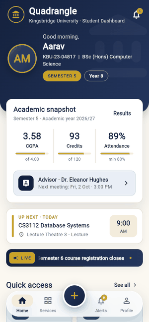
</p>

<p align="center"><b>Try it yourself:</b> <a href="https://faahee.github.io/quadrangle-campus-app/">faahee.github.io/quadrangle-campus-app</a></p>

## Screenshots

### Home dashboard

<table>
  <tr>
    <td align="center">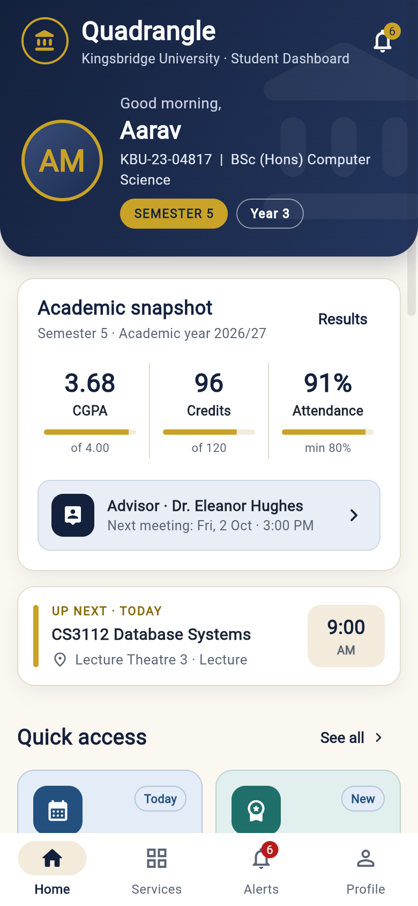<br><sub><b>Header & academic snapshot</b></sub></td>
    <td align="center">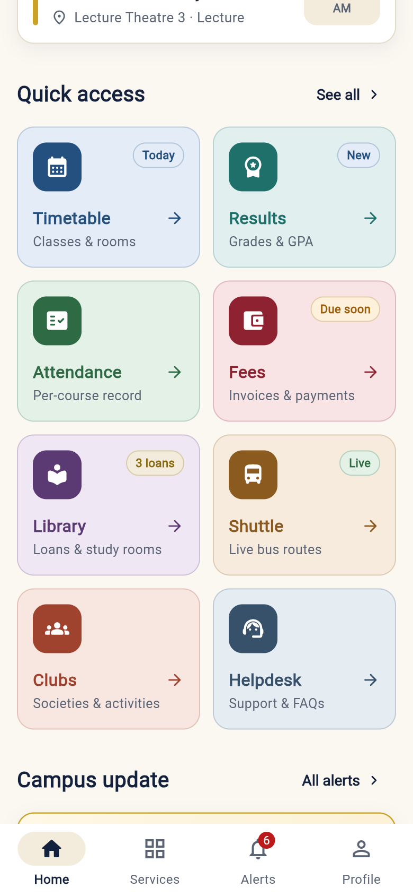<br><sub><b>Quick access grid</b></sub></td>
    <td align="center">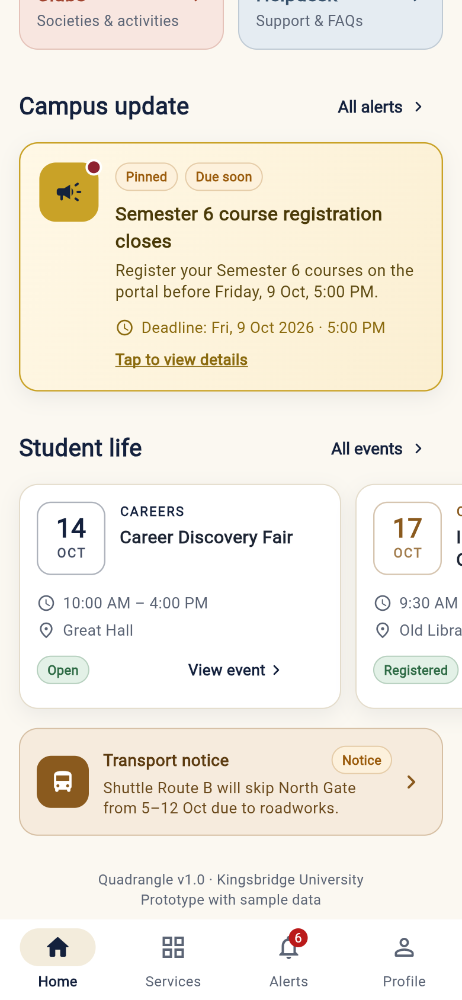<br><sub><b>Campus update & student life</b></sub></td>
  </tr>
</table>

### Student life

<table>
  <tr>
    <td align="center">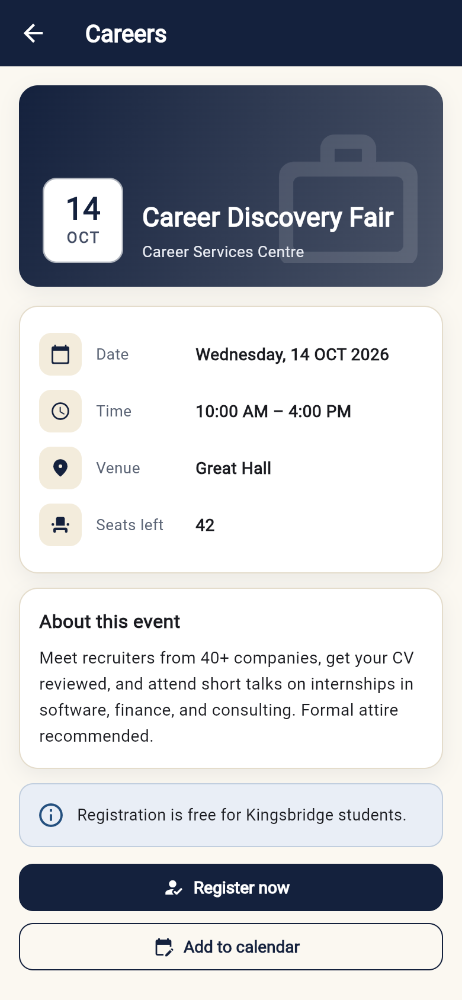<br><sub><b>Event details</b></sub></td>
    <td align="center">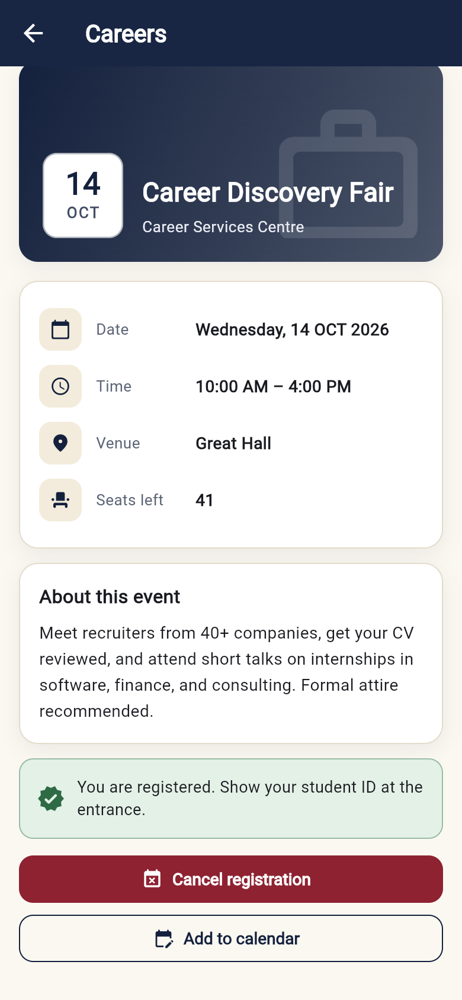<br><sub><b>After tapping “Register now”</b></sub></td>
  </tr>
</table>

### Campus services

<table>
  <tr>
    <td align="center">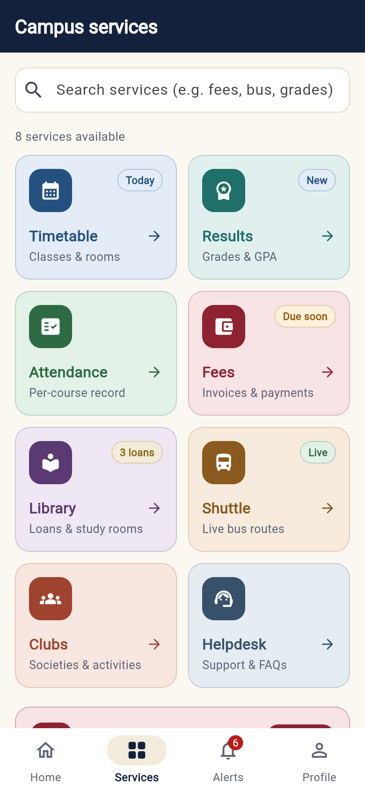<br><sub><b>Services (searchable)</b></sub></td>
    <td align="center">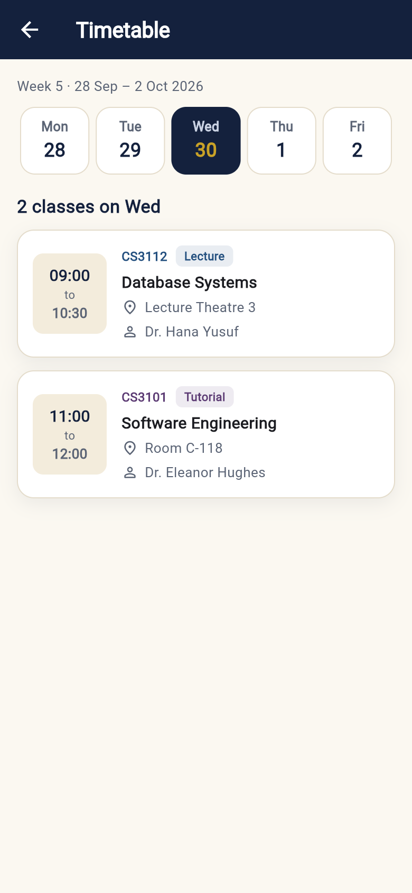<br><sub><b>Timetable</b></sub></td>
    <td align="center">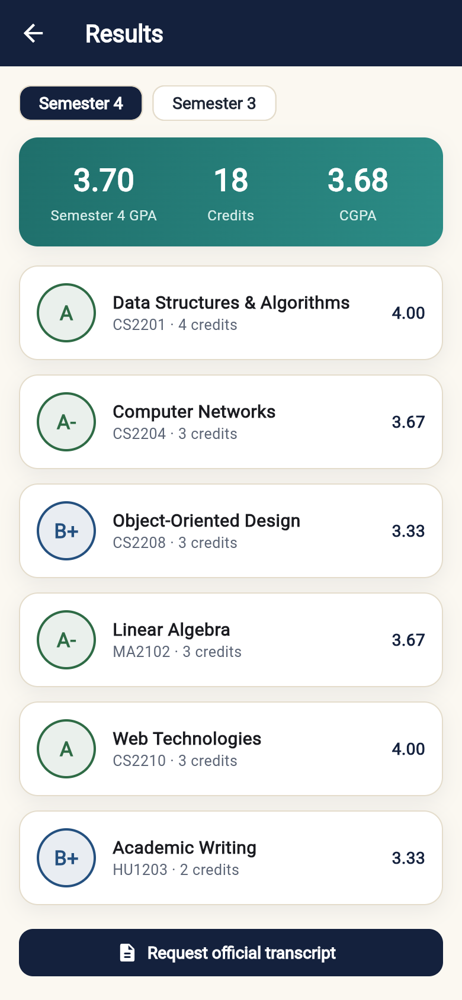<br><sub><b>Results</b></sub></td>
    <td align="center">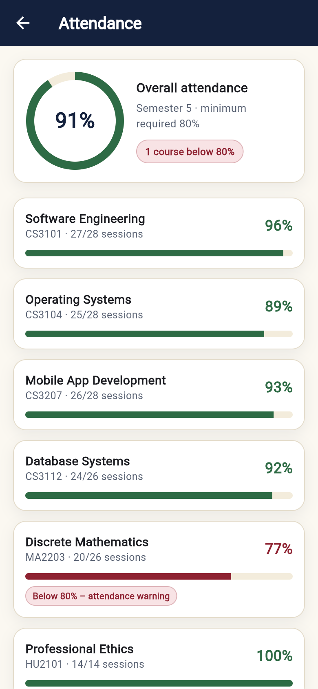<br><sub><b>Attendance</b></sub></td>
  </tr>
  <tr>
    <td align="center">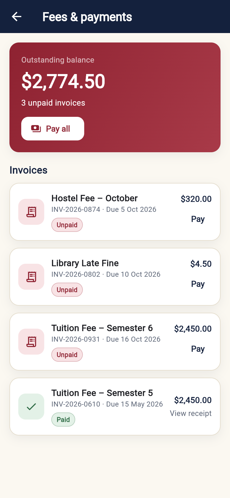<br><sub><b>Fees & payments</b></sub></td>
    <td align="center">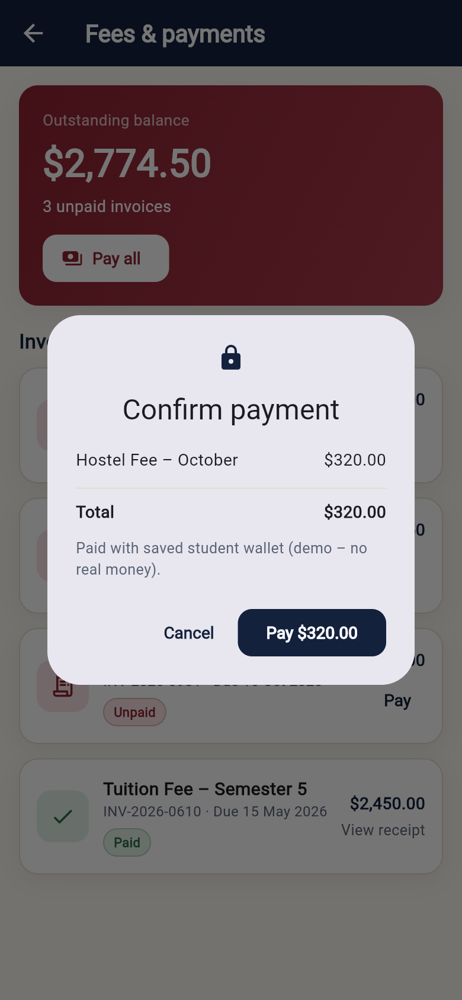<br><sub><b>Payment confirmation</b></sub></td>
    <td align="center">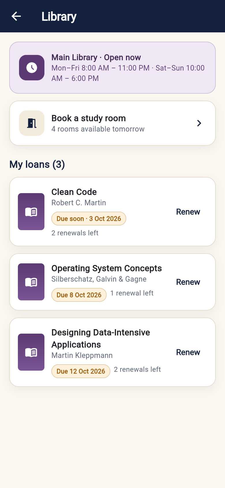<br><sub><b>Library</b></sub></td>
    <td align="center">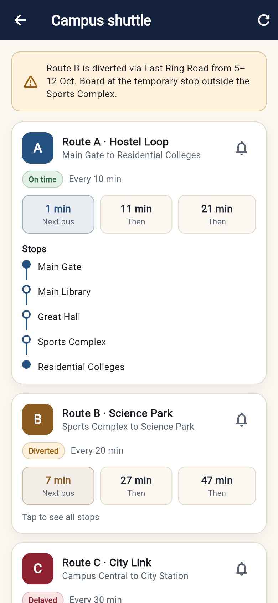<br><sub><b>Shuttle (stops expanded)</b></sub></td>
  </tr>
  <tr>
    <td align="center">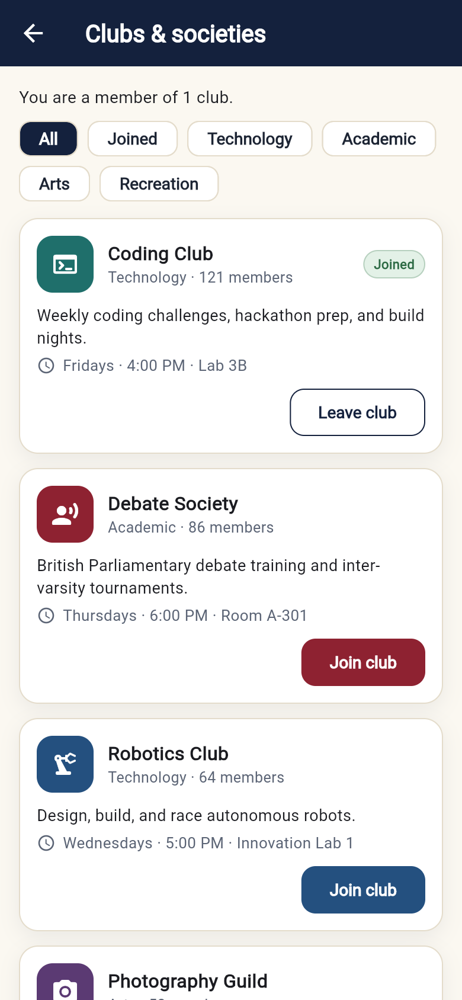<br><sub><b>Clubs & societies</b></sub></td>
    <td align="center">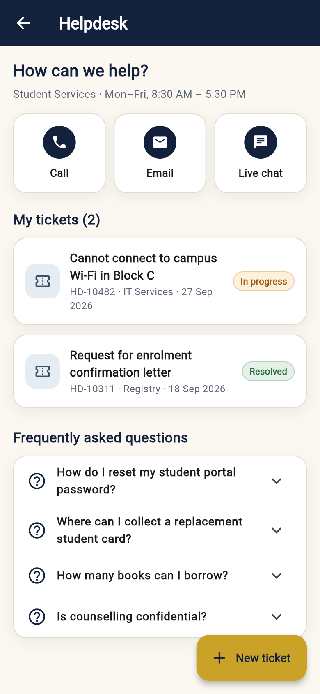<br><sub><b>Helpdesk</b></sub></td>
    <td></td>
    <td></td>
  </tr>
</table>

### Alerts & profile

<table>
  <tr>
    <td align="center">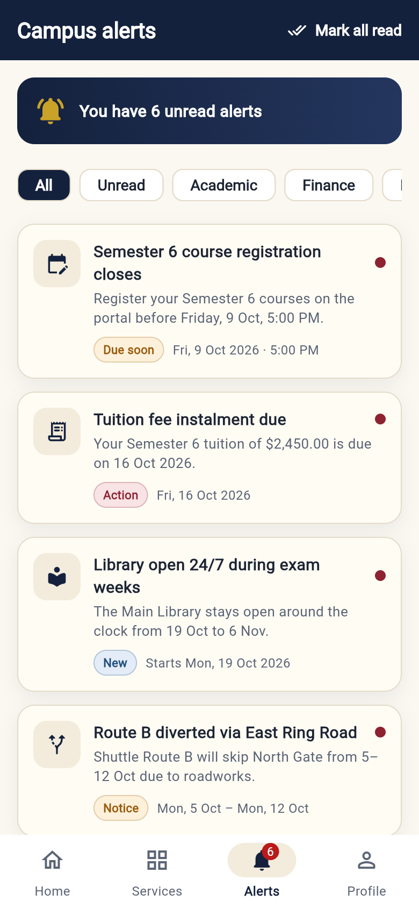<br><sub><b>Alerts inbox</b></sub></td>
    <td align="center">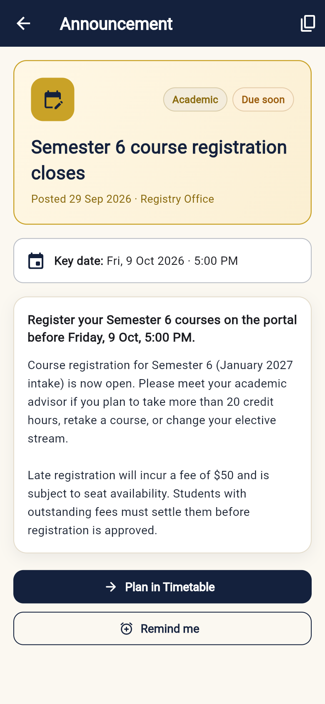<br><sub><b>Announcement details</b></sub></td>
    <td align="center">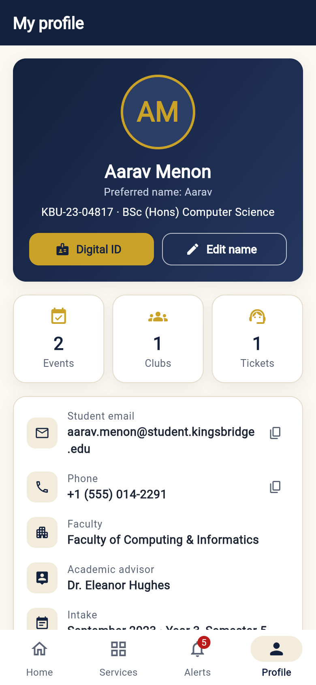<br><sub><b>Profile</b></sub></td>
    <td align="center">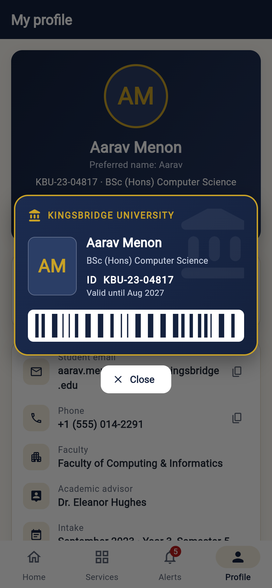<br><sub><b>Digital student ID</b></sub></td>
  </tr>
</table>

## How it works

### A typical session

1. **Open the app.** The header greets the student by preferred name
   (*Good morning / afternoon / evening*), shows their ID, programme and
   semester, and the bell displays the number of unread alerts.
2. **Check academics at a glance.** Tapping CGPA or Credits opens **Results**;
   tapping Attendance opens **Attendance**. The advisor strip opens a dialog to
   confirm the next appointment.
3. **See what's next.** The *Up next* card reads the timetable, finds the next
   class after the current time (today, tomorrow, or the next weekday), and
   opens the **Timetable** when tapped.
4. **Jump into a service.** Each Quick access card opens its own page. Actions
   on those pages change shared state — paying an invoice lowers the
   outstanding balance, renewing a book moves its due date, joining a club
   increases its member count.
5. **Read campus updates.** Opening an announcement marks it as read, which
   instantly updates the bell badge, the navigation badge, and the alerts list.
   Each announcement also links to the most relevant service (for example,
   *Pay in Fees* or *Open Shuttle*).
6. **Join student life.** Event cards open a details page. *Register now*
   switches the card to **Registered**, reduces seats left, and shows a
   confirmation — tap again to cancel.
7. **Manage the profile.** Show the **digital student ID**, change the
   preferred name (the dashboard greeting updates immediately), toggle
   notification settings, or sign out.

### What every button does

| Where | Action |
|---|---|
| Bell icon (header) | Opens the Alerts tab — badge shows the unread count |
| Avatar (header) | Opens the Profile tab |
| CGPA / Credits / Attendance | Open Results / Attendance |
| Advisor strip | Dialog → confirm appointment (SnackBar feedback) |
| Up next card | Opens Timetable |
| Quick access cards | Open Timetable, Results, Attendance, Fees, Library, Shuttle, Clubs, Helpdesk |
| Campus update card | Announcement details (marks it as read) |
| Event cards | Event details → Register / Cancel, Add to calendar |
| Transport notice | Opens Shuttle |
| Timetable | Switch day; tap a class → set or remove a reminder |
| Results | Switch semester (GPA recalculated); request an official transcript |
| Attendance | Tap a course → absence summary and *Submit MC* |
| Fees | *Pay* / *Pay all* with confirmation; view receipts for paid invoices |
| Library | *Renew* (+14 days, max two); *Book a study room* (room + time) |
| Shuttle | Refresh random live times; *Notify me* per route; tap to show stops |
| Clubs | Filter by category; *Join* / *Leave* |
| Helpdesk | Call, Email, Live chat; *New ticket* form with validation; FAQs |
| Alerts | Filter chips, *Mark all read*, open details, copy to clipboard |
| Profile | Digital ID, Edit name, copy email / phone, settings switches, About, Sign out |

## Architecture

The app uses **only the Flutter SDK** — no third-party packages.

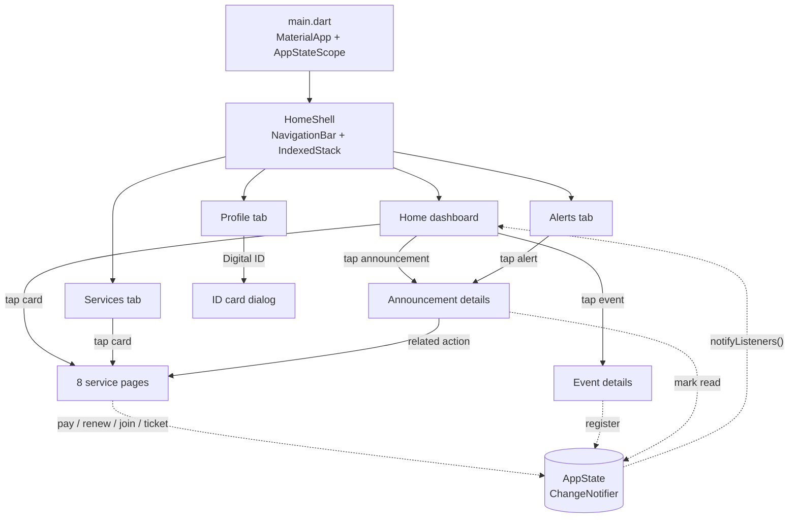

| Layer | Implementation |
|---|---|
| **Data** | `lib/data/sample_data.dart` holds all fictional data; `models.dart` defines plain Dart classes |
| **State** | `AppState` (a `ChangeNotifier`) exposed through an `InheritedNotifier` (`AppStateScope`). Any widget that calls `AppStateScope.of(context)` rebuilds automatically when state changes |
| **Navigation** | Bottom `NavigationBar` + `IndexedStack` (tabs keep their scroll position); service and detail pages use `Navigator.push` via `service_router.dart` |
| **UI components** | Reusable widgets in `lib/widgets/` — `CampusActionCard`, `EventCard`, `StatusBadge`, `IconTile`, `DateTile`, `CampusCard`, `SectionHeader` |
| **Responsiveness** | `LayoutBuilder` switches the grid between 2 and 4 columns; content is constrained to a readable max width on tablets and desktop |

## Design system

A classic academic palette with serif headings (Georgia on iOS, Noto Serif on
Android) and a single, consistent card style.

| Role | Colour | Hex |
|---|---|---|
| Primary — Oxford navy |  | `#14213D` |
| Accent — Heritage gold |  | `#C9A227` |
| Background tint — Ivory |  | `#FBF8F1` |
| Background tint — Parchment |  | `#F3ECDC` |
| Info tint — Mist |  | `#E9EEF6` |

**Card style:** 16 px radius · 1 px parchment border · soft navy shadow
(blur 14, y-offset 5, 7 % opacity) · 14–20 px padding · 12–16 px spacing.
Each campus service has its own deep colour and matching light tint.

## Getting started

### Prerequisites

- [Flutter](https://docs.flutter.dev/get-started/install) **3.47+** (stable channel), which includes Dart 3.13
- For mobile: Android Studio with an emulator, or Xcode with an iOS simulator
- For web: Google Chrome

### Run locally

```bash
git clone https://github.com/faahee/quadrangle-campus-app.git
cd quadrangle-campus-app
flutter pub get
flutter run                 # choose a connected device / emulator
flutter run -d chrome       # run in the browser
```

### Test

```bash
flutter test
```

The widget tests check that every required dashboard section renders, that a
service card opens its page, and that the bottom navigation switches tabs.

### Build

```bash
flutter build web --release   # output in build/web
flutter build apk --release   # Android APK
```

## Deployment

The live demo is hosted on **GitHub Pages** and deployed automatically by
[`.github/workflows/deploy.yml`](.github/workflows/deploy.yml) on every push to `main`:

1. Check out the code and install Flutter (stable).
2. `flutter pub get` and `flutter test` — deployment stops if a test fails.
3. `flutter build web --release --base-href "/<repo-name>/"`.
4. Upload `build/web` and publish it with `actions/deploy-pages`.

## Project structure

```
lib/
├── main.dart                         # MaterialApp + shared state
├── theme/app_theme.dart              # Colour system, card style, Material theme
├── data/
│   ├── models.dart                   # Data classes
│   └── sample_data.dart              # Fictional student, services, alerts, events…
├── state/app_state.dart              # ChangeNotifier + InheritedNotifier scope
├── widgets/
│   ├── campus_action_card.dart       # ★ Reusable CampusActionCard + responsive grid
│   ├── common_widgets.dart           # IconTile, StatusBadge, DateTile, CampusCard…
│   ├── announcement_card.dart        # Featured announcement + alert tile
│   └── event_card.dart               # Event card with date tile
└── screens/
    ├── home_shell.dart               # Bottom navigation (Home, Services, Alerts, Profile)
    ├── dashboard_screen.dart         # ★ Main dashboard
    ├── services_screen.dart          # Searchable services grid
    ├── alerts_screen.dart            # Filterable announcements
    ├── profile_screen.dart           # Profile, digital ID, settings
    ├── announcement_detail_screen.dart
    ├── event_detail_screen.dart
    ├── events_screen.dart
    ├── service_router.dart           # Opens the right page for each service
    └── services/                     # Timetable, Results, Attendance, Fees,
                                      # Library, Shuttle, Clubs, Helpdesk
docs/                                 # README banner, demo GIF, screenshots
test/widget_test.dart                 # Widget tests
.github/workflows/deploy.yml          # GitHub Pages deployment
```

## Assessment checklist

<details>
<summary><b>Functional & content requirements (Section 6)</b></summary>

| # | Requirement | Where it is implemented |
|---|---|---|
| 1 | MaterialApp, Scaffold, SafeArea, scrollable body | `main.dart`, `home_shell.dart`, `dashboard_screen.dart` (`SingleChildScrollView`) |
| 2 | 10+ meaningful Containers | Header, crest, avatar, pills, snapshot card, divider, advisor strip, next-class card + accent bar + time tile, action cards, announcement, event cards, date tiles, transport notice, footer |
| 3 | Profile section | Name, student ID, programme, initials avatar, time-based greeting |
| 4 | Academic section | CGPA, credits, attendance, advisor |
| 5 | Quick access (4+) | Eight services, each with a distinct icon and colour |
| 6 | Announcement | Semester 6 registration deadline with date and *Due soon* badge |
| 7 | Student life | Four events and a transport notice |
| 8 | Interaction | `InkWell` / `GestureDetector` on cards, tiles, avatar, day selector |
| 9 | Feedback | Navigation, SnackBars, dialogs, bottom sheets, colour and state changes |
| 10 | Reusable component | `CampusActionCard` (also `EventCard`, `StatusBadge`, `IconTile`, `DateTile`) |

</details>

<details>
<summary><b>Container techniques (Section 7)</b></summary>

| Technique | Evidence |
|---|---|
| Width & height | Avatar 76×76, icon tiles, date tiles, accent bar 5×58, time tile 72×58 |
| Margin | Section headers, next-class card, transport notice, event cards |
| Padding | Every card (14–20 px) |
| Alignment | Avatar initials, icon tiles, footer text (`Alignment.center`) |
| Constraints | `BoxConstraints(minHeight: 128)` on action cards, `maxWidth: 760` responsive body, `minHeight: 48` touch targets |
| BoxDecoration | Cards, header, badges, tiles — colour is always inside the decoration |
| Border | Action cards, gold announcement border, date tiles, avatar ring |
| Border radius | 16 px cards, 12 px tiles, 28 px header corners |
| Box shadow | `AppStyle.softShadow` on cards; stronger shadow under the header |
| Colour treatment | Navy primary, gold accent, ivory and parchment tints |
| Child composition | `Row`, `Column`, `Wrap`, and `Stack` inside Containers |

</details>

<details>
<summary><b>Student customisation (Section 8)</b></summary>

| Category | Choice |
|---|---|
| App identity | *Quadrangle* · Kingsbridge University · Student Dashboard |
| Colour system | Navy `#14213D`, gold `#C9A227`, ivory `#FBF8F1`, parchment `#F3ECDC` |
| Profile | Aarav Menon · `KBU-23-04817` · BSc (Hons) Computer Science |
| Academic indicators | CGPA, credits, attendance, advisor |
| Campus services | Timetable, Results, Attendance, Fees, Library, Shuttle, Clubs, Helpdesk |
| Announcement | Semester 6 registration closes Fri, 9 Oct 2026, 5:00 PM |
| Student life | Career Discovery Fair, Chess Open, Flutter Build Night, Charity Run, shuttle notice |
| Card style | 16 px radius, 1 px border, soft shadow, rounded icon tiles, 16 px spacing |
| Layout choice | Responsive `Wrap` grid — 2 columns on phones, 4 on tablets |
| Interaction | Every card navigates or gives SnackBar / dialog feedback |
| Visual detail | Gradient header, crest watermark, status badges, progress bars, date tiles |
| Accessibility | 48 px targets, `Semantics` labels, ≥ 12.5 px text, high contrast |

</details>

## Roadmap

- [ ] Real authentication and student data (e.g. Firebase or a university API)
- [ ] Dark mode using the same navy and gold palette
- [ ] Persist settings, registrations and payments on the device
- [ ] Push notifications for deadlines and shuttle arrivals
- [ ] Localisation into additional languages

## Credits

Built by **[@faahee](https://github.com/faahee)** as a Flutter coursework project.
Icons from [Material Icons](https://fonts.google.com/icons). Kingsbridge
University and all people, IDs and records in the app are fictional.
